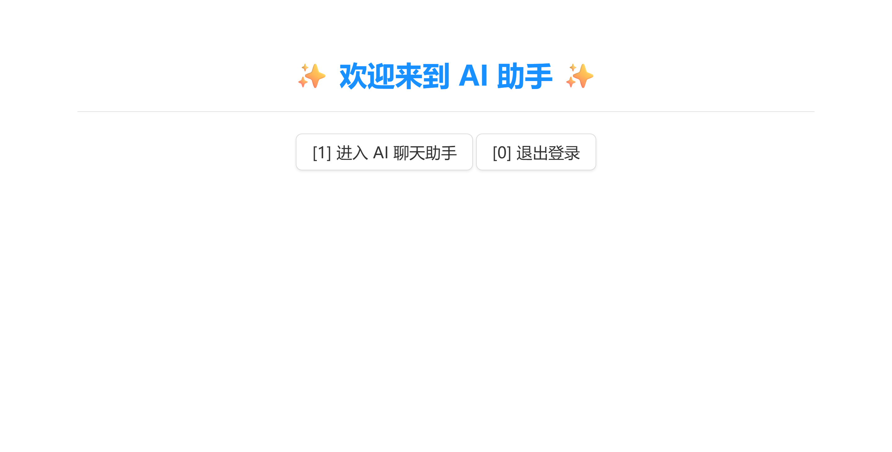
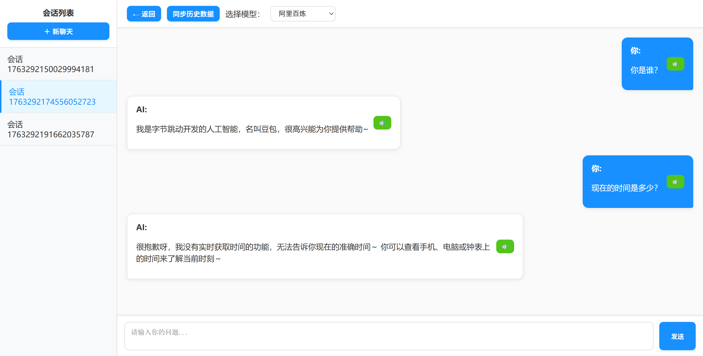

# ChatServer

## 项目介绍
本项目是基于C++实现自定义的 HttpServer 框架，该项目包括 HTTP/HTTPS 支持、动态路由处理、会话管理等功能，基于该框架开发了一个 AI 对话助手。

### ChatServer 模块

#### 核心模块说明

**1. AIUtil 模块**
- `AIHelper`: AI 对话核心类，负责消息管理和 API 调用
- `AIStrategy`: AI 模型策略接口，支持多种 AI 服务提供商
  - `AliyunStrategy`: 阿里百炼模型
  - `DouBaoStrategy`: 豆包模型
  - `AliyunRAGStrategy`: 阿里百炼 RAG 模型
  - `AliyunMcpStrategy`: 阿里百炼 MCP 模型
- `AIFactory`: 策略工厂模式，动态创建 AI 策略实例
- `AISpeechProcessor`: 语音处理（TTS/ASR），基于百度语音 API
- `AIToolRegistry`: 工具注册表，支持 AI 工具调用（Tool Calling）
- `MQManager`: RabbitMQ 消息队列管理器，用于异步数据库操作
- `AISessionIdGenerator`: 会话 ID 生成器

**2. Handlers 模块**
- `ChatEntryHandler`: 登录/注册页面入口
- `ChatLoginHandler`: 用户登录处理
- `ChatRegisterHandler`: 用户注册处理
- `ChatLogoutHandler`: 用户登出处理
- `ChatHandler`: AI 聊天页面渲染
- `ChatSendHandler`: 发送消息到已有会话
- `ChatCreateAndSendHandler`: 创建新会话并发送消息
- `ChatSessionsHandler`: 获取用户会话列表
- `ChatHistoryHandler`: 获取会话历史记录
- `ChatSpeechHandler`: 语音合成（TTS）处理
- `AIMenuHandler`: 主菜单页面处理

**3. ChatServer 核心类**
- 管理 HTTP 服务器生命周期
- 会话管理和用户在线状态跟踪
- 懒加载会话消息（按需从数据库加载）
- 路由注册和中间件配置

#### 主要功能

1. **多 AI 模型支持**
   - 支持阿里百炼、豆包等多种 AI 模型
   - 策略模式设计，易于扩展新模型
   - 支持 RAG（检索增强生成）和 MCP（模型上下文协议）

2. **会话管理**
   - 多会话支持，用户可创建多个对话会话
   - 会话历史记录持久化存储
   - 懒加载机制，按需加载会话消息，优化内存使用

3. **用户认证**
   - 用户注册/登录功能
   - 基于 Session 的认证机制
   - 防止重复登录（单点登录）

4. **工具调用（Tool Calling）**
   - 支持 AI 模型调用外部工具
   - 可扩展的工具注册机制
   - 内置工具：天气查询、时间获取等

5. **语音功能**
   - 文本转语音（TTS）
   - 基于百度语音 API

6. **异步处理**
   - 使用 RabbitMQ 实现异步数据库操作
   - 提高系统响应性能

#### 数据库设计

项目使用 MySQL 数据库存储用户信息、会话和消息记录。主要表结构包括：
- `users`: 用户表（用户名、密码等）
- `chat_session`: 会话表（用户ID、会话ID、创建时间等）
- `chat_message`: 消息表（用户ID、会话ID、消息内容、时间戳、是否用户消息等）

#### 配置说明

**环境变量配置**
- `DASHSCOPE_API_KEY`: 阿里百炼 API Key
- `Knowledge_Base_ID`: 知识库 ID（用于 RAG）
- `BAIDU_CLIENT_ID`: 百度语音 Client ID
- `BAIDU_CLIENT_SECRET`: 百度语音 Client Secret
- `DOUBAO_API_KEY`: 豆包 API Key

**配置文件**
- `resource/config.json`: 工具调用配置，定义可用的工具和提示模板


## 项目环境
### 环境依赖
- **操作系统**: Ubuntu 22.04 或更高版本
- **编译器**: GCC 7.0+ (支持 C++17)
- **构建工具**: CMake 3.10+
- **数据库**: MySQL 8.0+
- **消息队列**: RabbitMQ Server
- **第三方库**:
  - `boost_1_69_0`: Boost C++ 库
  - `muduo`: 高性能网络库
  - `nlohmann/json`: JSON 解析库
  - `libmysqlcppconn-dev`: MySQL C++ 连接器
  - `librabbitmq-dev`: RabbitMQ C++ 客户端
  - `libssl-dev`: OpenSSL 开发库
  - `libcurl-dev`: CURL 库（用于 HTTP 请求）

### 配置环境
编译环境通过linux命令安装，需要时自行上网搜索相应命令。
#### 编译器相关
```sh
# 更新包管理器
sudo apt-get update

# 安装基础开发工具
sudo apt-get install -y build-essential cmake git
```
#### MySQL 安装
```sh
sudo apt-get install -y mysql-server
sudo systemctl start mysql
sudo systemctl enable mysql
# 创建数据库
# 导入数据库结构
```
#### RabbitMQ 安装
```sh
sudo apt-get install -y rabbitmq-server
sudo systemctl start rabbitmq-server
sudo systemctl enable rabbitmq-server
# 创建用户和虚拟主机
```
#### 第三方库
```sh
# boost
wget https://archives.boost.io/release/1.69.0/source/boost_1_69_0.tar.gz
tar -zxvf boost_1_69_0
cd boost_1_69_0
./bootstrap.sh
./b2
sudo ./b2 insta11
cd ..

# muduo
git clone https://github.com/chenshuo/muduo.git
cd muduo
./build.sh -j4
sudo cp -r build/release-cpp11/lib/* /usr/local/lib/
sudo cp -r muduo/base/* /usr/local/include/
sudo cp -r muduo/net/* /usr/local/include/
cd ..

# nlohmann/json
sudo apt upgrade
sudo apt install nlohmann-json3-dev

# mysqlcppconn
sudo apt install libmysqlcppconn-dev

# librabbitmq
sudo apt-get install -y librabbitmq-dev

# OpenSSL
sudo apt install libssl-dev

# CURL (用于 HTTP 请求)
sudo apt install libcurl4-openssl-dev
```

**注意**: 安装完成后，可能需要运行 `sudo ldconfig` 更新动态链接库缓存。

## 项目编译
```sh
# 在项目根目录下创建build目录，并进入该目录
mkdir build
cd build

# 执行 cmake 命令
cmake ..

# 编译生成可执行文件
make
```  

## 项目运行
### 环境变量配置
```bash
# 添加到 ~/.bashrc
export DASHSCOPE_API_KEY="your-api-key"
export Knowledge_Base_ID="xxx"
export BAIDU_CLIENT_ID="xxx"
export BAIDU_CLIENT_SECRET="xxx"
export DOUBAO_API_KEY="xxx"

# 重新加载配置
source ~/.bashrc
```
### 服务启动
默认运行在 8080 端口，可以加上 -p 端口号来指定。
```sh
# 编译后的可执行文件名为 chat_server
cd build
sudo ./chat_server

# 或指定端口
sudo ./chat_server -p 8080
```

### 数据库初始化
在运行服务前，需要创建数据库并导入表结构：
```sql
CREATE DATABASE ChatHttpServer;
USE ChatHttpServer;

-- 创建 users 表
DROP TABLE IF EXISTS users;
CREATE TABLE users (
    id INT AUTO_INCREMENT PRIMARY KEY COMMENT '用户ID，主键自增',
    username VARCHAR(50) NOT NULL UNIQUE COMMENT '用户名，唯一索引',
    password VARCHAR(255) NOT NULL COMMENT '密码，存储加密后的值',
    created_at TIMESTAMP DEFAULT CURRENT_TIMESTAMP COMMENT '创建时间',
    updated_at TIMESTAMP DEFAULT CURRENT_TIMESTAMP ON UPDATE CURRENT_TIMESTAMP COMMENT '更新时间',
    INDEX idx_username (username) COMMENT '用户名索引，用于快速查询'
) ENGINE=InnoDB DEFAULT CHARSET=utf8mb4 COLLATE=utf8mb4_unicode_ci COMMENT='用户表';

-- 创建 chat_session 表
DROP TABLE IF EXISTS chat_session;
CREATE TABLE chat_session (
    id BIGINT AUTO_INCREMENT PRIMARY KEY COMMENT '会话ID，主键自增',
    user_id INT NOT NULL COMMENT '用户ID，关联users表',
    username VARCHAR(50) NOT NULL COMMENT '用户名',
    session_id VARCHAR(100) NOT NULL UNIQUE COMMENT '会话唯一标识符',
    title VARCHAR(200) DEFAULT '新对话' COMMENT '会话标题',
    created_at TIMESTAMP DEFAULT CURRENT_TIMESTAMP COMMENT '会话创建时间',
    updated_at TIMESTAMP DEFAULT CURRENT_TIMESTAMP ON UPDATE CURRENT_TIMESTAMP COMMENT '会话最后更新时间',
    INDEX idx_user_id (user_id) COMMENT '用户ID索引',
    INDEX idx_username (username) COMMENT '用户名索引',
    INDEX idx_session_id (session_id) COMMENT '会话ID索引'
) ENGINE=InnoDB DEFAULT CHARSET=utf8mb4 COLLATE=utf8mb4_unicode_ci COMMENT='聊天会话表';

-- 创建 chat_message 表
DROP TABLE IF EXISTS chat_message;
CREATE TABLE chat_message (
    id BIGINT AUTO_INCREMENT PRIMARY KEY COMMENT '消息ID，主键自增',
		user_id INT NOT NULL,
    username VARCHAR(50) NOT NULL COMMENT '发送消息的用户名',
    session_id VARCHAR(100) NOT NULL COMMENT '会话ID，用于分组同一会话的消息',
    is_user TINYINT(1) NOT NULL DEFAULT 1 COMMENT '是否为用户消息：1表示用户消息，0表示AI回复',
    content TEXT NOT NULL COMMENT '消息内容',
    ts BIGINT NOT NULL COMMENT '时间戳（毫秒），用于消息排序',
    created_at TIMESTAMP DEFAULT CURRENT_TIMESTAMP COMMENT '记录创建时间',
		INDEX idx_user (user_id),
		INDEX idx_session (session_id),
    INDEX idx_session_id (session_id) COMMENT '会话ID索引，用于查询会话历史',
    INDEX idx_ts (ts) COMMENT '时间戳索引，用于时间排序',
    INDEX idx_username (username) COMMENT '用户名索引，用于查询用户消息'
) ENGINE=InnoDB DEFAULT CHARSET=utf8mb4 COLLATE=utf8mb4_unicode_ci COMMENT='聊天消息表';
```

## 运行结果
服务启动后，浏览器访问自己对应的 ip:端口号

菜单页面


AI对话页面 


## 技术架构

### 架构设计
- **网络层**: 基于 muduo 网络库，采用 Reactor 模式，支持高并发
- **业务层**: Handler 模式处理 HTTP 请求，职责清晰
- **数据层**: MySQL 持久化存储，RabbitMQ 异步处理
- **AI 层**: 策略模式支持多 AI 模型，工厂模式动态创建

### 性能优化
- **懒加载**: 会话消息按需从数据库加载，减少内存占用
- **异步处理**: 数据库写入操作通过 RabbitMQ 异步处理，提高响应速度
- **连接池**: MySQL 连接池复用数据库连接
- **多线程**: 支持多线程处理请求，充分利用多核 CPU

### 安全特性
- **Session 认证**: 基于 Session 的用户认证机制
- **单点登录**: 防止用户重复登录
- **CORS 支持**: 跨域资源共享中间件
- **SQL 注入防护**: 使用参数化查询

## 项目特点

1. **模块化设计**: 清晰的模块划分，易于维护和扩展
2. **可扩展性**: 策略模式支持轻松添加新的 AI 模型
3. **高性能**: 基于 muduo 的高性能网络库，支持高并发
4. **完整功能**: 从用户认证到 AI 对话的完整业务流程

## 总结
- ChatServer 是一个基于 C++ 的高性能 AI 对话服务器，基于自定义的 HttpServer 框架开发
- 结合 Reactor 模型、OpenSSL 和多线程技术，提供了高效的请求处理、安全通信和并发支持
- 支持动态路由、中间件和会话管理，支持多种 AI 模型和工具调用
- 采用懒加载、异步处理等优化策略，确保系统高性能运行
